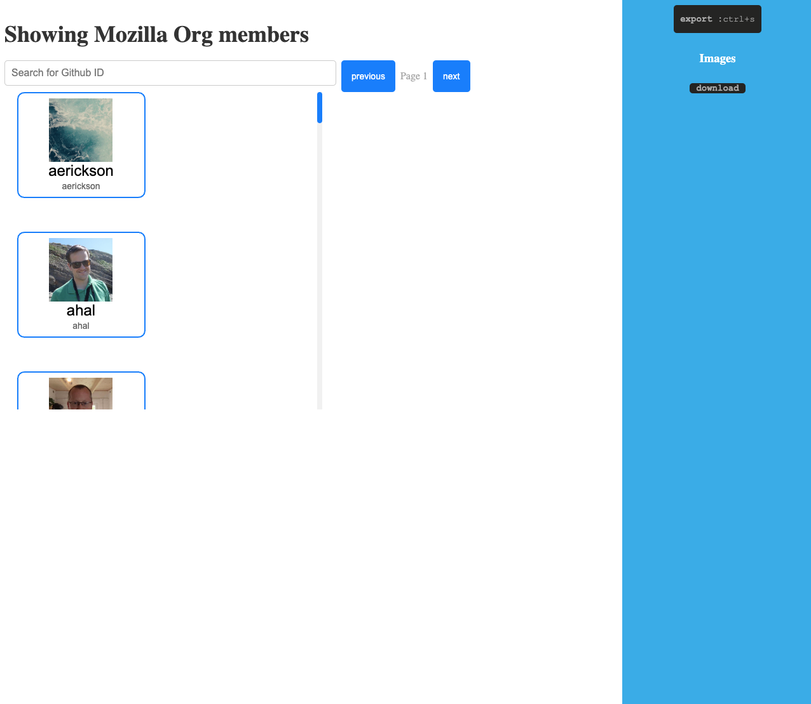
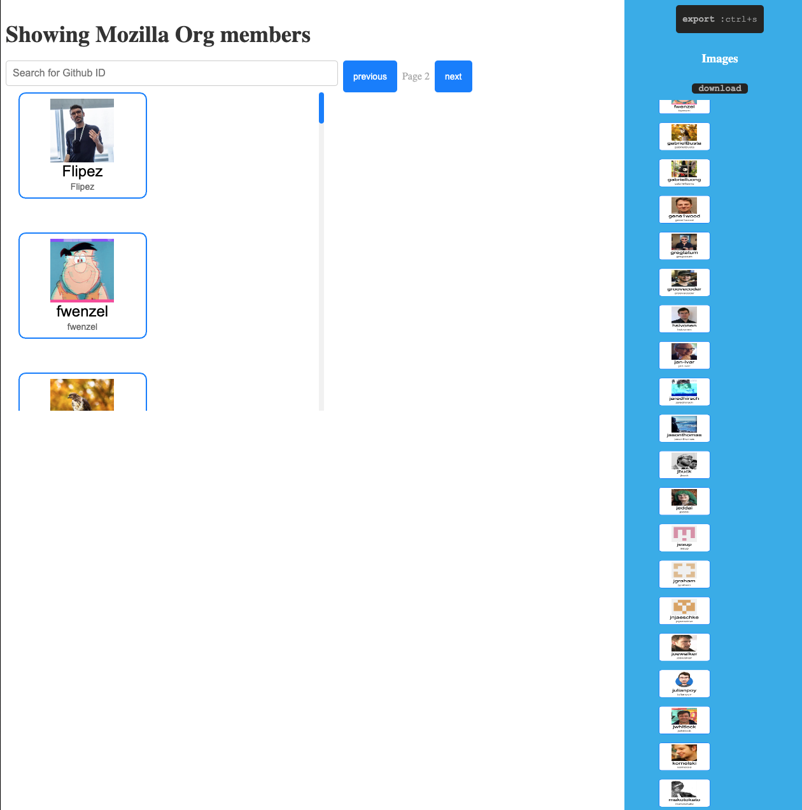

# Demo
https://makaravind.github.io/svelte-canvas-github/

# Start

```
npm install
npm run dev
```

# Features
- Canvas list of Github org members
- Github member name card styled with details
- Interactive canvas - draggable, hover, changes opacity on interaction with other name cards
- Search for members
- Pagination to show members of next page or previous page
- ctrl+s hotkey to save the image
- double click on the name card to open member profile
- download the saved image of Github members


## Screenshots





